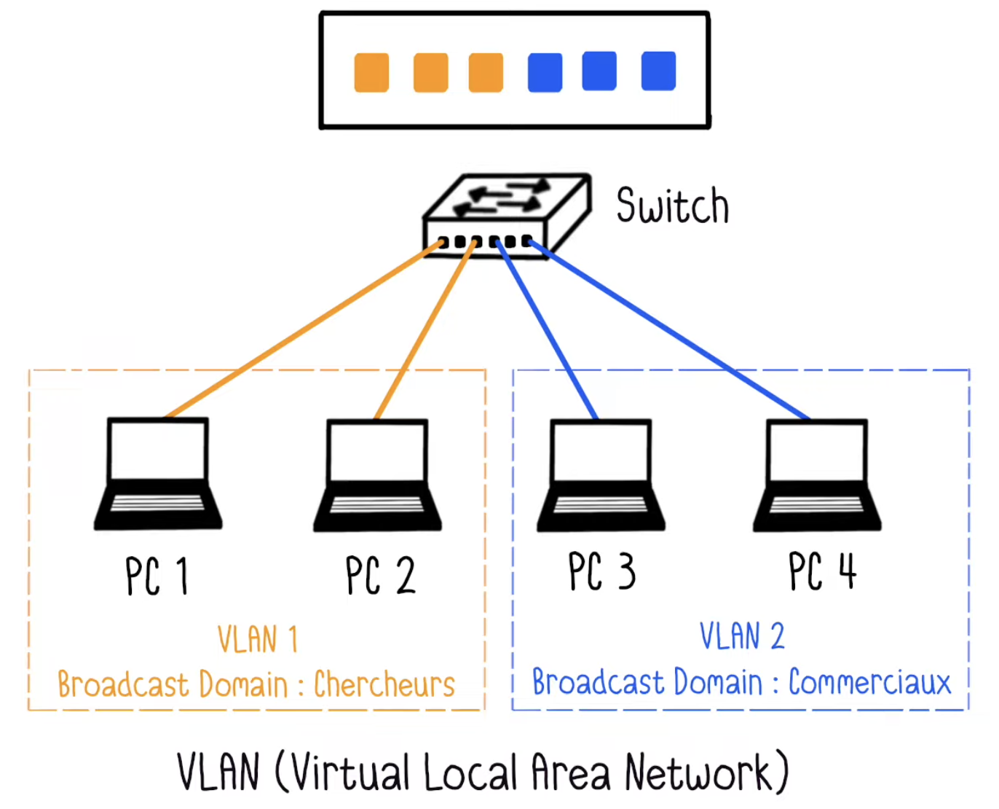
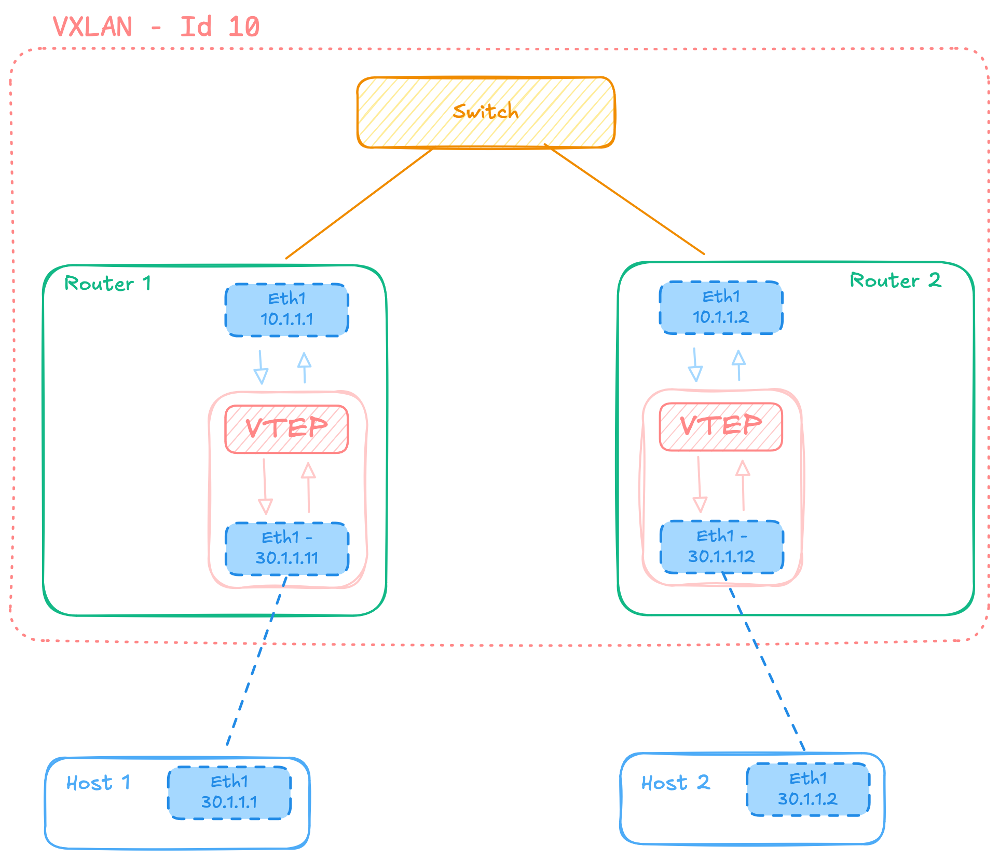
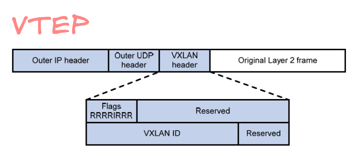

<h1 align="center">
  <a href="https://github.com/jdecorte-be/42-BADASS"></a>
  42-BADASS
  <br>
</h1>

<p align="center">
  <a href="https://github.com/jdecorte-be/42-BADASS">
    
  </a>
  <a href="https://github.com/jdecorte-be/42-BADASS">
    
  </a>
  <a href="https://github.com/jdecorte-be/42-BADASS/stargazers">
    
  </a>
</p>

<p align="center">
  <a href="https://github.com/jdecorte-be/42-BADASS/issues">
    
  </a>
  <a href="https://github.com/jdecorte-be/42-BADASS">
    
  </a>
  <a href="https://github.com/jdecorte-be/42-BADASS">
    
  </a>
  <a href="https://github.com/jdecorte-be/42-BADASS">
    
  </a>
  <a href="https://github.com/jdecorte-be/42-BADASS">
    
  </a>  
</p>

<p align="center">
  <a href="#overview">Overview</a> •
  <a href="#objectives">Objectives</a> •
  <a href="#docker-images">Docker Images</a> •
  <a href="#vxlan">VXLAN</a> •
  <a href="#bgp-evpn">BGP EVPN</a> •
  <a href="#architecture">Architecture</a> •
  <a href="#license">License</a>
</p>


# 🧩 Part 1 - GNS3 Configuration with docker
This first part of the **BADASS (Bgp At Doors of Autonomous Systems is Simple)** project introduces the setup of a virtual lab environment using **GNS3** and **Docker**.  
You will create and configure two Docker images to emulate network devices used throughout the project.

The goal is to build a working base for future parts — **VXLAN** and **BGP EVPN**.

## ⚙️ Objectives
1. Install and configure **GNS3** and **Docker** inside your virtual machine.  
2. Create **two Docker images**:
   - One lightweight container for basic network testing.
   - One router container with active routing daemons.
3. Verify connectivity between containers inside GNS3.

## 🧱 Docker Images

### 🐋 Image 1 — Host (Base System)
A minimal image with essential networking tools.

**Requirements:**
- Based on a small system (e.g., Alpine or BusyBox)
- Must include:
  - `busybox` (or equivalent)
  - Basic network utilities (`ping`, `ip`, `ifconfig`, etc.)

**Purpose:**  
Simulate end hosts for connectivity testing in later parts.

---

### 🐋 Image 2 — Router (Network Daemon System)
A routing-capable image that will be used as your **virtual router**.

**Requirements:**
- Based on a Linux distribution (Alpine recommended)
- Must include:
  - `zebra` or `quagga` (routing manager)
  - `bgpd` (BGP service)
  - `ospfd` (OSPF service)
  - `isisd` (IS-IS service)
  - `busybox` or equivalent minimal tools


# 🌐 Part 2 — Discorvering VXLAN

## VLAN - Virtual LAN

A VLAN (Virtual Local Area Network) is a logical subdivision of a physical network.

It allows you to group devices together—even if they’re not physically connected to the same switch—so that they behave as if they are on the same local network.

Think of a VLAN as a virtual “room” inside your network: only the devices in that room can talk directly to each other, unless traffic is explicitly routed between rooms.

# VXLAN – Virtual Extensible LAN
VXLAN (Virtual eXtensible LAN) is a network virtualization technology that extends Layer 2 networks (Ethernet) over a Layer 3 (IP) infrastructure.

## Why VXLAN?
Since traditional VLANs are limited to **4096 IDs**, VXLAN was designed for **data centers** to scale up to **16 million virtual networks**.  
VXLAN encapsulates Layer 2 frames inside Layer 3 UDP packets (default port **4789**).

### Advantages

**1. Performance improvement**  
VLANs limit broadcast domains to smaller user groups, reducing unnecessary network traffic and optimizing bandwidth.  
➡️ [Learn more](https://www.fingerinthenet.com/vlan/)

**2. Security enhancement**  
By isolating users or devices into different VLANs, communication between them requires routing through a firewall or router. This helps prevent malware propagation and protects sensitive data.  
➡️ [Learn more](https://securikeys-it.com/quels-sont-les-avantages-dun-vlan/)

**3. Cost reduction**  
Logical segmentation avoids deploying separate physical networks for each group. VLANs share infrastructure, cutting equipment and maintenance costs while simplifying network management.  
➡️ [Learn more](http://cisco.ofppt.info/ccna2/course/module3/3.1.1.2/3.1.1.2.html)




🌍 Part 3 — Discovering BGP with EVPN
------------------------------------

### 🛰️ Introduction

**BGP EVPN (Ethernet VPN)** combines **BGP (Border Gateway Protocol)** and **EVPN (Ethernet VPN)** to create a scalable and efficient **Layer 2 and Layer 3 network overlay** on top of an IP-based infrastructure.  
This part of the BADASS project introduces how **VXLAN tunnels** are dynamically managed through **BGP EVPN route exchanges** — eliminating the need for static configurations.

---

### ⚙️ Objectives

By the end of this part, you should be able to:

1. Configure **BGP sessions** between routers to exchange EVPN routes.  
2. Establish **VXLAN tunnels automatically** using BGP control-plane signaling.  
3. Understand and implement **EVPN route types**.  
4. Validate the **end-to-end connectivity** between hosts over the EVPN fabric.  
5. Visualize how **MAC and IP learning** are distributed using the BGP EVPN mechanism.

---

### 🧠 Key Concepts

| Concept | Description |
|----------|--------------|
| **BGP (Border Gateway Protocol)** | A dynamic routing protocol that exchanges network reachability information between autonomous systems (AS). |
| **EVPN (Ethernet VPN)** | An extension of BGP for Layer 2 VPNs that allows MAC/IP address learning and advertisement through BGP instead of flooding. |
| **VXLAN (Virtual eXtensible LAN)** | A tunneling technology that encapsulates Layer 2 Ethernet frames in Layer 3 UDP packets (port `4789`). |
| **VNI (VXLAN Network Identifier)** | 24-bit segment ID used to identify logical Layer 2 domains (similar to VLAN ID). |
| **VTEP (VXLAN Tunnel End Point)** | The device that performs VXLAN encapsulation and decapsulation at the network edge. |

---

### 📡 EVPN Route Types

| Route Type | Name | Description |
|-------------|------|-------------|
| **Type 2** | MAC/IP Advertisement | Advertises MAC and IP addresses learned from connected hosts. |
| **Type 3** | Inclusive Multicast Ethernet Tag | Used for broadcast, unknown unicast, and multicast (BUM) traffic. |
| **Type 5** | IP Prefix Route | Advertises IP prefixes for L3 forwarding between VNIs (inter-VNI routing). |

These route types enable **multi-tenant segmentation** and **efficient control-plane learning** without relying on flooding mechanisms.

---

### 🧱 Topology Example

Below is an example of a minimal **EVPN fabric** composed of two routers and two hosts connected via VXLAN tunnels:

```text
          +---------------------+
          |     Host 1 (VNI 10) |
          +----------+----------+
                     |
               +-------------+
               |   Router A  |--- BGP EVPN ---+
               |  (VTEP 1)   |                |
               +-------------+                |
                                              |
                                         +-------------+
                                         |   Router B  |
                                         |  (VTEP 2)   |
                                         +------+------+ 
                                                |
                                       +--------+--------+
                                       |   Host 2 (VNI 10) |
                                       +--------------------+
